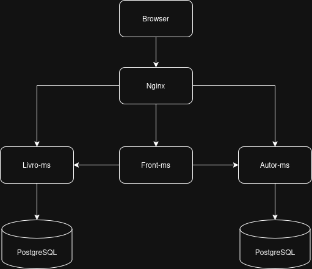

# Sistema Bibliotecário

Trabalho final da disciplina Desenvolvimento Web com Java — Ciência da
Computação, IFCE. Sistema de cadastro de livros e autores implementado como
arquitetura de microsserviços com Spring Boot, Thymeleaf, PostgreSQL, Docker e
Nginx.

## Arquitetura

Seis containers orquestrados via Docker Compose:



Cada microsserviço REST tem seu próprio banco PostgreSQL. `livro-ms` **não**
faz JOIN com a tabela de autores: ele armazena apenas `autorId` (referência
lógica, sem FK no banco). Quem resolve o nome do autor de cada livro é o
`front-ms`, consultando `autor-ms` via HTTP antes de renderizar a página.

| Serviços        | Tecnologia                          | Responsabilidade                                                   |
|----------------|--------------------------------------|----------------------------------------------------------------------|
| `nginx`        | Nginx (imagem oficial)               | Gateway: roteamento, CORS centralizado, ponto único de entrada       |
| `front-ms`     | Spring Boot + Thymeleaf + RestClient | Interface web; consome `livro-ms`/`autor-ms` e renderiza HTML        |
| `livro-ms`     | Spring Boot + REST + JPA             | CRUD de livros; guarda `autorId` como `Long`, não conhece `autor-ms` |
| `autor-ms`     | Spring Boot + REST + JPA             | CRUD de autores; serviço independente                               |

## Como executar

Pré-requisitos: Docker e Docker Compose.

```bash
docker compose up --build
```

Aguarde a inicialização dos bancos e dos serviços (a primeira execução cria o
schema automaticamente via Hibernate). Depois, acesse:

```
http://localhost
```

Outros comandos úteis:

```bash
docker compose down        # encerra os containers, preserva os volumes (dados continuam)
docker compose restart     # reinicia os containers, dados persistem
docker compose down -v     # encerra E remove os volumes nomeados (apaga todos os dados)
```

## Estrutura do repositório

```
tjw_sistema_bibliotecario/
  autor/      módulo Spring Boot do autor-ms (Dockerfile próprio)
  livro/      módulo Spring Boot do livro-ms (Dockerfile próprio)
  front/      módulo Spring Boot do front-ms (Dockerfile próprio)
  nginx/      nginx.conf versionado, usado pelo container nginx
  docker-compose.yml
```

Cada módulo (`autor`, `livro`, `front`) é um projeto Maven independente, sem
parent pom compartilhado.

## Endpoints REST

### autor-ms (`/api/autores`, via nginx ou diretamente em `autor-ms:8082`)

| Método | Rota                | Descrição                                  |
|--------|----------------------|---------------------------------------------|
| GET    | `/api/autores`       | Lista todos os autores (`[]` se vazio)       |
| GET    | `/api/autores/{id}`  | Busca autor por id (404 se não existir)      |
| POST   | `/api/autores`       | Cadastra autor (201 + objeto criado)         |
| PUT    | `/api/autores/{id}`  | Substitui todos os campos do autor (PUT completo) |
| DELETE | `/api/autores/{id}`  | Remove autor (204 sem corpo)                 |

### livro-ms (`/api/livros`, via nginx ou diretamente em `livro-ms:8081`)

| Método | Rota                                   | Descrição                                       |
|--------|------------------------------------------|---------------------------------------------------|
| GET    | `/api/livros` ou `/api/livros?disponivel=true\|false` | Lista livros, com filtro opcional de disponibilidade |
| GET    | `/api/livros/{id}`                       | Busca livro por id (404 se não existir)            |
| POST   | `/api/livros`                            | Cadastra livro (201 + objeto criado)               |
| PUT    | `/api/livros/{id}`                       | Substitui todos os campos do livro (PUT completo)  |
| DELETE | `/api/livros/{id}`                       | Remove livro (204 sem corpo)                       |

Formato de erro padronizado nos dois serviços:
- 404: `{"erro": "Autor não encontrado: 999"}`
- 400 (validação): `{"erro": "Dados inválidos", "campos": {"nome": "não pode ser vazio"}}`

### front-ms (interface web, via nginx em `/`)

`/autores`, `/autores/novo`, `/autores/{id}/editar`, `/autores/{id}/excluir`,
`/livros`, `/livros/novo`, `/livros/{id}`, `/livros/{id}/editar`,
`/livros/{id}/excluir`.

## Decisões de design

- **Sem FK entre `livro` e `autor`**: decisão arquitetural deliberada da
  arquitetura de microsserviços (cada serviço com banco próprio); a
  integridade referencial é responsabilidade da aplicação (`front-ms`), não do
  banco.
- **Resolução de nome de autor por livro**: o `front-ms` faz uma chamada a
  `autor-ms` por livro listado (N+1). Aceitável dado o escopo acadêmico e o
  volume de dados esperado.
- **`spring.jpa.hibernate.ddl-auto=update`**: cria/atualiza o schema
  automaticamente a partir das entidades JPA, sem necessidade de migrations
  versionadas (Flyway/Liquibase), suficiente para o escopo do trabalho.
- **Falha de um microsserviço não derruba o front-ms**: o `front-ms` trata
  timeouts/erros de conexão/5xx das chamadas a `livro-ms`/`autor-ms` e exibe
  mensagens amigáveis (ex.: "Autor removido", "Serviço indisponível") em vez
  de propagar a exceção como página de erro genérica.
